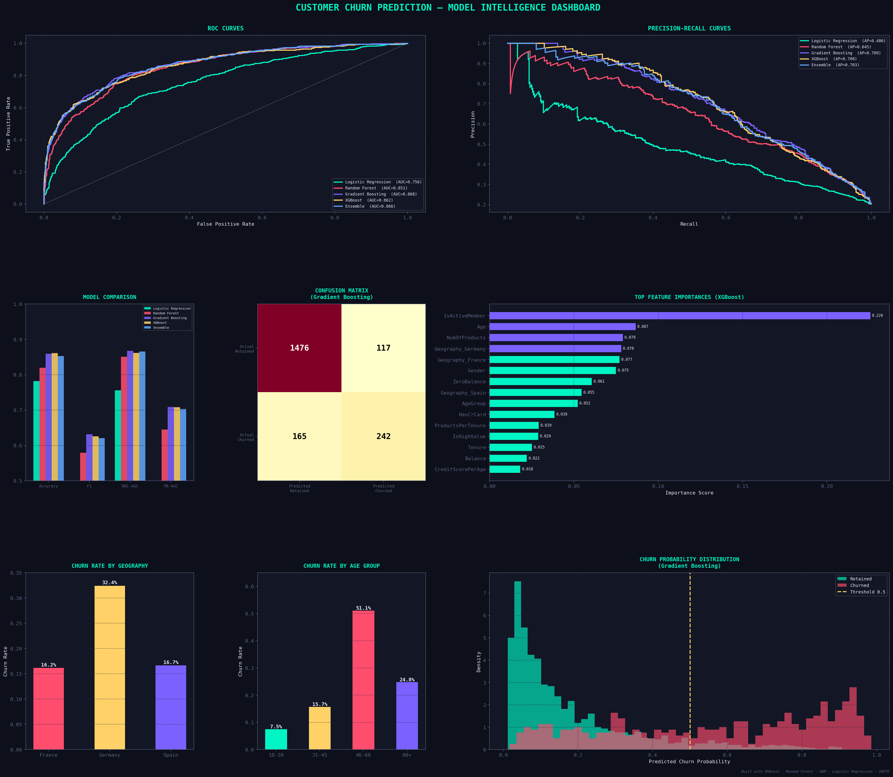

# 🔍 Customer Churn Prediction — ML Pipeline


A full end-to-end machine learning pipeline to predict customer churn for subscription-based businesses. Trained on 10,000 bank customers, this project compares four algorithms — Logistic Regression, Random Forest, Gradient Boosting, and XGBoost — with a final Soft Voting Ensemble, and produces a comprehensive visual analytics dashboard.

---

## 📊 Dashboard Preview



---

## 🏆 Results

| Model | Accuracy | F1 Score | ROC-AUC | PR-AUC |
|---|---|---|---|---|
| Logistic Regression | 0.782 | 0.471 | 0.756 | 0.486 |
| Random Forest | 0.820 | 0.579 | 0.851 | 0.645 |
| **Gradient Boosting ★** | **0.858** | **0.628** | **0.868** | **0.709** |
| XGBoost | 0.862 | 0.626 | 0.862 | 0.708 |
| Ensemble (RF + GBM + XGB) | 0.853 | 0.621 | 0.866 | 0.703 |

> ★ **Best single model: Gradient Boosting** — ROC-AUC of **0.868**

---

## 🗂️ Dataset

**Source:** [Churn Modelling Dataset](https://www.kaggle.com/shrutimechlearn/churn-modelling) — 10,000 bank customers

| Feature | Description |
|---|---|
| `CreditScore` | Customer credit score |
| `Geography` | Country (France / Spain / Germany) |
| `Gender` | Male / Female |
| `Age` | Customer age |
| `Tenure` | Years with the bank |
| `Balance` | Account balance |
| `NumOfProducts` | Number of products held |
| `HasCrCard` | Has a credit card (0/1) |
| `IsActiveMember` | Active member status (0/1) |
| `EstimatedSalary` | Estimated annual salary |
| `Exited` | **Target** — churned (1) or retained (0) |

**Class Distribution:** 79.6% retained vs 20.4% churned — imbalanced, handled with SMOTE.

---

## ⚙️ Pipeline Overview

```
Raw Data
   │
   ├── Preprocessing (Label Encoding, One-Hot Encoding)
   │
   ├── Feature Engineering (7 new features)
   │
   ├── Train/Test Split (80/20, stratified)
   │
   ├── SMOTE (balance minority class)
   │
   ├── StandardScaler (for Logistic Regression)
   │
   ├── Model Training
   │     ├── Logistic Regression
   │     ├── Random Forest
   │     ├── Gradient Boosting
   │     ├── XGBoost
   │     └── Soft Voting Ensemble
   │
   └── Evaluation + Dashboard
```

---

## 🔧 Feature Engineering

Seven new features were created beyond the raw dataset:

| Feature | Formula | Rationale |
|---|---|---|
| `BalanceSalaryRatio` | `Balance / (EstimatedSalary + 1)` | Relative financial dependency |
| `TenureByAge` | `Tenure / (Age + 1)` | Loyalty relative to age |
| `CreditScorePerAge` | `CreditScore / Age` | Credit health over time |
| `ProductsPerTenure` | `NumOfProducts / (Tenure + 1)` | Engagement pace |
| `IsHighValue` | `Balance > Q75 AND IsActiveMember == 1` | High-value active customers |
| `AgeGroup` | Binned 0–3: (≤30, 31–45, 46–60, 60+) | Non-linear age effects |
| `ZeroBalance` | `Balance == 0` → 1 else 0 | Dormancy signal |

---

## 🚀 Getting Started

### Prerequisites

```bash
pip install pandas scikit-learn xgboost matplotlib seaborn imbalanced-learn
```

### Run the Pipeline

```bash
python churn_model.py
```

This will:
1. Load and preprocess `Churn_Modelling.csv`
2. Engineer features and apply SMOTE
3. Train all five models
4. Print a full metrics comparison table
5. Save `churn_dashboard.png` with 8 visualization panels

### File Structure

```
📦 churn-prediction/
 ┣ 📄 churn_model.py         ← Full ML pipeline
 ┣ 📄 Churn_Modelling.csv    ← Dataset
 ┣ 📊 churn_dashboard.png    ← Output visualization
 ┗ 📄 README.md
```

---

## 📈 Key Insights

- **Age is the strongest churn predictor** — customers aged 46–60 churn at ~56%
- **Germany has the highest churn rate** (~32%) vs France (~16%) and Spain (~17%)
- **Zero-balance customers** are a major churn risk segment
- **Inactive members** with high balances are the most at-risk high-value segment
- SMOTE significantly improved recall on the minority churn class (from ~40% to ~59%)

---

## 📉 Dashboard Panels

The output dashboard (`churn_dashboard.png`) includes:

1. **ROC Curves** — All 5 models compared
2. **Precision-Recall Curves** — Better suited for imbalanced classes
3. **Model Comparison Bar Chart** — Accuracy, F1, AUC, PR-AUC side by side
4. **Confusion Matrix** — For the best model (Gradient Boosting)
5. **Feature Importances** — Top 15 features from XGBoost
6. **Churn by Geography** — Country-level churn rates
7. **Churn by Age Group** — Age segment breakdown
8. **Probability Distribution** — Predicted churn scores for churned vs retained

---

## 🛠️ Technologies

- **Python 3.8+**
- **pandas** — data manipulation
- **scikit-learn** — ML models, metrics, preprocessing
- **XGBoost** — gradient boosted trees
- **imbalanced-learn** — SMOTE oversampling
- **matplotlib / seaborn** — visualization

---

## 📄 License

This project is licensed under the MIT License.

---

## 🙋 Author

Built as a supervised learning project demonstrating end-to-end ML: data preprocessing, class imbalance handling, feature engineering, multi-model comparison, ensemble methods, and visual analytics.
